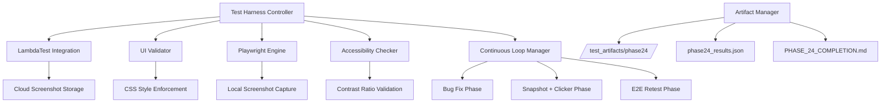
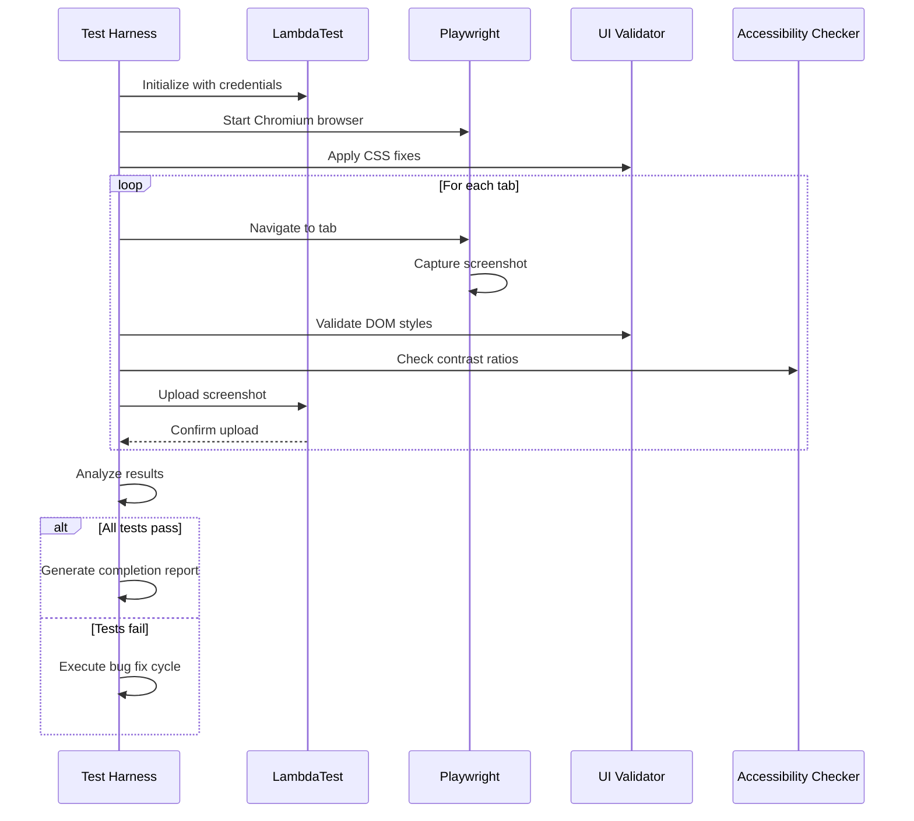

# Design Document

## Overview

The LambdaTest UI Validation system is a comprehensive testing framework that integrates cloud-based visual regression testing with local Chromium automation. The system enforces UI consistency standards, validates accessibility compliance, and executes continuous testing loops until achieving 100% success rate across all dashboard components.

## Architecture

### High-Level Architecture



### Component Interaction Flow



## Components and Interfaces

### 1. LambdaTest Integration Component

**Purpose**: Manages cloud-based screenshot uploads and validation

**Interface**:
```python
class LambdaTestIntegrator:
    def __init__(self, username: str, access_key: str)
    def authenticate(self) -> bool
    def upload_screenshot(self, image_path: str, tags: Dict[str, str]) -> str
    def verify_upload(self, upload_id: str) -> bool
    def generate_validation_report(self) -> Dict[str, Any]
```

**Key Methods**:
- `authenticate()`: Validates credentials against LambdaTest API
- `upload_screenshot()`: Uploads visual artifacts with metadata tags
- `verify_upload()`: Confirms successful upload via REST API
- `generate_validation_report()`: Creates lambda_validation.json

### 2. UI Validator Component

**Purpose**: Enforces consistent styling and visual standards

**Interface**:
```python
class UIValidator:
    def apply_global_css_fixes(self, page: Page) -> None
    def validate_computed_styles(self, page: Page) -> ValidationResult
    def check_element_visibility(self, page: Page, selectors: List[str]) -> bool
    def detect_visual_anomalies(self, screenshot_path: str) -> List[str]
```

**CSS Enforcement Rules**:
- Target selectors: `.form-control`, `.dash-input`, `input[type="text"]`, `textarea`
- Enforced styles: `background-color: white !important; color: black !important;`
- Implementation: JavaScript injection for runtime style application

### 3. Playwright Engine Component

**Purpose**: Browser automation and screenshot capture

**Interface**:
```python
class PlaywrightEngine:
    def __init__(self, browser_type: str = "chromium")
    def navigate_to_tab(self, tab_name: str) -> None
    def capture_screenshot(self, filename: str) -> str
    def execute_click_sequence(self, selectors: List[str]) -> List[str]
    def get_dom_snapshot(self) -> Dict[str, Any]
```

**Tab Navigation Map**:
- Home: `/` or base URL
- Options Lab: `/options-lab` or tab selector
- Strategy Lab: `/strategy-lab` or tab selector  
- Market Trends: `/market-trends` or tab selector
- Research Lab: `/research-lab` or tab selector

### 4. Accessibility Checker Component

**Purpose**: Validates WCAG compliance and contrast ratios

**Interface**:
```python
class AccessibilityChecker:
    def check_contrast_ratio(self, element: ElementHandle) -> float
    def validate_minimum_contrast(self, page: Page) -> List[ContrastViolation]
    def generate_accessibility_report(self) -> Dict[str, Any]
```

**Validation Criteria**:
- Minimum contrast ratio: 4.5:1 for normal text
- Target elements: All text inputs, labels, buttons
- Color extraction: RGB values from computed styles

### 5. Test Harness Controller

**Purpose**: Orchestrates the entire testing workflow

**Interface**:
```python
class TestHarnessController:
    def __init__(self, config: TestConfig)
    def execute_full_validation(self) -> TestResults
    def run_continuous_loop(self) -> None
    def generate_final_report(self) -> None
```

**Workflow States**:
1. **Initialization**: Setup browsers, authenticate services
2. **Validation**: Execute tests across all tabs
3. **Analysis**: Process results and identify failures
4. **Remediation**: Apply fixes and retry failed tests
5. **Completion**: Generate reports and artifacts

## Data Models

### TestConfig
```python
@dataclass
class TestConfig:
    lambdatest_username: str
    lambdatest_access_key: str
    target_tabs: List[str]
    screenshot_directory: str
    max_retry_attempts: int
    success_threshold: float = 1.0  # 100%
```

### ValidationResult
```python
@dataclass
class ValidationResult:
    tab_name: str
    success: bool
    screenshot_path: str
    dom_snapshot: Dict[str, Any]
    style_violations: List[str]
    contrast_violations: List[ContrastViolation]
    timestamp: datetime
```

### ContrastViolation
```python
@dataclass
class ContrastViolation:
    element_selector: str
    foreground_color: str
    background_color: str
    contrast_ratio: float
    required_ratio: float
```

## Error Handling

### Authentication Failures
- **Scenario**: Invalid LambdaTest credentials
- **Response**: Log detailed error, halt execution, provide credential validation steps
- **Recovery**: Manual credential verification required

### Screenshot Upload Failures
- **Scenario**: Network issues or API rate limits
- **Response**: Implement exponential backoff retry mechanism
- **Recovery**: Retry up to 3 times with increasing delays

### Browser Automation Failures
- **Scenario**: Element not found, page load timeout
- **Response**: Capture debug screenshot, log DOM state
- **Recovery**: Retry with extended timeouts, fallback selectors

### Style Validation Failures
- **Scenario**: CSS injection fails or styles not applied
- **Response**: Log computed styles, capture before/after screenshots
- **Recovery**: Alternative CSS injection methods, direct DOM manipulation

## Testing Strategy

### Unit Testing
- **LambdaTest Integration**: Mock API responses, test credential validation
- **UI Validator**: Test CSS injection, style computation validation
- **Accessibility Checker**: Test contrast calculation algorithms
- **Playwright Engine**: Test screenshot capture, navigation reliability

### Integration Testing
- **End-to-End Workflow**: Full pipeline from initialization to report generation
- **Cross-Component**: Verify data flow between components
- **Error Scenarios**: Test failure handling and recovery mechanisms

### Performance Testing
- **Screenshot Capture Speed**: Measure time per screenshot across tabs
- **Upload Performance**: Monitor LambdaTest API response times
- **Memory Usage**: Track browser memory consumption during long test runs

### Validation Testing
- **Visual Regression**: Compare screenshots against baseline images
- **Accessibility Compliance**: Verify WCAG 2.1 AA standards
- **Functional Validation**: Ensure all interactive elements work correctly

## Implementation Phases

### Phase 1: Core Infrastructure
1. Set up project structure and configuration management
2. Implement LambdaTest authentication and basic API integration
3. Create Playwright browser automation foundation
4. Establish artifact storage and logging systems

### Phase 2: UI Validation Engine
1. Implement CSS style enforcement mechanisms
2. Create DOM snapshot and validation utilities
3. Build accessibility checker with contrast ratio validation
4. Develop visual anomaly detection algorithms

### Phase 3: Test Execution Framework
1. Create tab navigation and screenshot capture workflows
2. Implement click sequence automation for interactive testing
3. Build continuous loop manager with retry logic
4. Develop comprehensive error handling and recovery

### Phase 4: Reporting and Analytics
1. Create detailed JSON result generation
2. Build visual diff comparison utilities
3. Implement completion report with summary tables
4. Add performance metrics and execution analytics

## Security Considerations

### Credential Management
- Store LambdaTest credentials in environment variables only
- Implement credential validation before test execution
- Log authentication attempts without exposing sensitive data

### Screenshot Privacy
- Ensure screenshots don't contain sensitive financial data
- Implement data masking for PII in visual artifacts
- Secure storage of test artifacts with appropriate permissions

### API Security
- Use HTTPS for all LambdaTest API communications
- Implement rate limiting to prevent API abuse
- Validate all API responses before processing

## Performance Optimization

### Screenshot Optimization
- Compress screenshots before upload to reduce bandwidth
- Implement parallel screenshot capture where possible
- Cache DOM snapshots to avoid redundant captures

### Browser Resource Management
- Implement browser instance pooling for efficiency
- Clean up browser resources after each test cycle
- Monitor and limit memory usage during long test runs

### Network Optimization
- Batch screenshot uploads when possible
- Implement connection pooling for API requests
- Use CDN endpoints for faster upload speeds