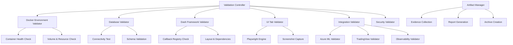
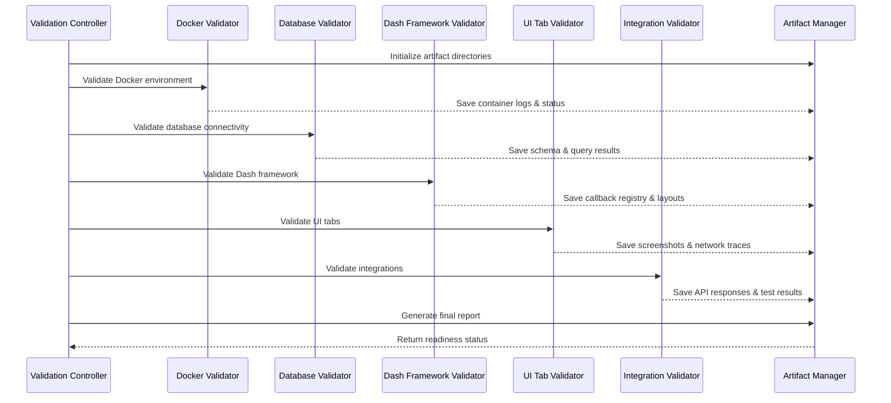

# Design Document

## Overview

The PRE-PHASE-24 Environment Validation system is a comprehensive diagnostic framework that validates all aspects of a financial dashboard application's deployment readiness. The system performs read-only validation across Docker containers, databases, web frameworks, integrations, and observability components, generating detailed artifacts and evidence-based reporting to ensure 100% deployment readiness.

## Architecture

### High-Level Architecture



### Component Interaction Flow



## Components and Interfaces

### 1. Validation Controller

**Purpose**: Orchestrates the entire validation workflow and manages execution order

**Interface**:
```python
class ValidationController:
    def __init__(self, config: ValidationConfig)
    def execute_full_validation(self) -> ValidationResults
    def should_abort_on_failure(self, result: ValidationResult) -> bool
    def generate_final_report(self) -> ReadinessSummary
```

**Key Responsibilities**:
- Execute validation checks in specified order (A through K)
- Implement immediate failure abort logic for critical issues
- Coordinate artifact collection across all validators
- Generate comprehensive readiness summary

### 2. Docker Environment Validator

**Purpose**: Validates Docker container health and resource availability

**Interface**:
```python
class DockerEnvironmentValidator:
    def validate_container_status(self) -> ContainerStatusResult
    def capture_container_logs(self, services: List[str]) -> LogCaptureResult
    def check_volume_health(self) -> VolumeHealthResult
    def test_http_reachability(self, endpoints: List[str]) -> ReachabilityResult
```

**Validation Steps**:
1. Execute `docker compose ps` and parse service statuses
2. Capture logs via `docker compose logs --tail 200` for app, db, ollama
3. Check disk usage with `docker system df`
4. Test HTTP GET to localhost:8050 and 8054 (if used)

### 3. Database Validator

**Purpose**: Validates database connectivity, schema integrity, and data presence

**Interface**:
```python
class DatabaseValidator:
    def test_connectivity(self) -> ConnectivityResult
    def validate_schema(self) -> SchemaValidationResult
    def check_migration_state(self) -> MigrationStateResult
    def sample_data_integrity(self) -> DataIntegrityResult
```

**Required Tables Validation**:
- weekly_picks, monthly_picks, price_cache
- backtest_runs, backtest_results, ml_prediction_runs
- options_forecasts, tradingview_signals, chat_conversations
- audit_log, jobs_queue, ml_models

### 4. Dash Framework Validator

**Purpose**: Validates Dash application structure and callback health

**Interface**:
```python
class DashFrameworkValidator:
    def validate_callback_registry(self) -> CallbackRegistryResult
    def test_dash_endpoints(self) -> DashEndpointResult
    def execute_baseline_callback_test(self) -> BaselineCallbackResult
    def capture_react_console_errors(self) -> ReactErrorResult
```

**Critical Endpoints**:
- `/_dash-layout`: Must return valid JSON
- `/_dash-dependencies`: Must return dependency graph
- `/_dash-update-component`: Baseline test without UI interaction

### 5. UI Tab Validator

**Purpose**: Validates visual rendering and interactive functionality of all dashboard tabs

**Interface**:
```python
class UITabValidator:
    def __init__(self, playwright_engine: PlaywrightEngine)
    def validate_home_tab(self) -> TabValidationResult
    def validate_command_center(self) -> TabValidationResult
    def validate_strategy_lab(self) -> TabValidationResult
    def validate_options_lab(self) -> TabValidationResult
    def validate_weekly_picks(self) -> TabValidationResult
    def validate_monthly_picks(self) -> TabValidationResult
```

**Tab-Specific Validation Logic**:

**Home Tab**:
- Load /#/home, capture screenshot
- Test visible primary buttons (Refresh, Run)
- Verify no 500 errors on button clicks

**Command Center**:
- Validate Market Pulse heatmap (Plotly DOM nodes)
- Check Jobs Queue table and API endpoint
- Test Quick Actions: restart-worker, flush-cache, refresh-prices
- Verify audit_log entries after actions

**Strategy Lab**:
- Validate all subtabs: Configure, Execute, Results, Benchmark, Risk, Factors
- Test Run Backtest functionality with database verification
- Ensure run_id consistency across subtabs
- Capture Plotly chart rendering

**Options Lab**:
- Validate contract selectors (ticker, strike, expiry)
- Test Generate Forecast with AAPL sample
- Verify options_forecasts database entries
- Capture forecast heatmap screenshot

### 6. Integration Validator

**Purpose**: Validates external service integrations and API endpoints

**Interface**:
```python
class IntegrationValidator:
    def validate_azure_ml_integration(self) -> AzureMLResult
    def validate_tradingview_webhook(self) -> TradingViewResult
    def validate_observability_stack(self) -> ObservabilityResult
    def validate_llm_integration(self) -> LLMResult
```

**Azure ML Validation**:
- Test Run Prediction button and network calls
- Verify ml_prediction_runs table entries
- Test Model Insights and Metrics buttons
- Capture API responses and database confirmations

**TradingView Validation**:
- Verify Signals Preview UI component
- Test /api/tradingview POST endpoint with sample payload
- Confirm tradingview_signals table insertions

### 7. Security Validator

**Purpose**: Validates authentication, authorization, and security configurations

**Interface**:
```python
class SecurityValidator:
    def test_admin_authentication(self) -> AuthResult
    def scan_credential_exposure(self) -> SecurityScanResult
    def validate_lambdatest_auth(self) -> LambdaTestAuthResult
    def check_environment_security(self) -> EnvironmentSecurityResult
```

**Security Checks**:
- Admin login with ADMIN_USERNAME/ADMIN_PASSWORD
- Repository scan for hard-coded credentials
- LambdaTest credential validation
- Environment variable security assessment

### 8. Artifact Manager

**Purpose**: Manages evidence collection, organization, and reporting

**Interface**:
```python
class ArtifactManager:
    def __init__(self, base_path: str = "reports/pre_phase24_validation")
    def save_screenshot(self, name: str, image_data: bytes) -> str
    def save_json_artifact(self, name: str, data: Dict[str, Any]) -> str
    def save_log_artifact(self, name: str, log_content: str) -> str
    def create_final_archive(self) -> str
```

**Artifact Organization**:
```
reports/pre_phase24_validation/
├── docker_ps.txt
├── logs/
│   ├── app.log
│   ├── db.log
│   └── ollama.log
├── env_vars.txt
├── python_and_packages.txt
├── db_tables.json
├── dash_layout.json
├── dash_dependencies.json
├── screenshots/
│   ├── home/
│   ├── command_center/
│   ├── strategy_lab/
│   ├── options_lab/
│   ├── weekly_picks/
│   └── monthly_picks/
├── har/
│   └── {tab}.har
├── db_samples/
│   └── *.json
├── readiness_summary.json
└── FINAL_STATUS.txt
```

## Data Models

### ValidationConfig
```python
@dataclass
class ValidationConfig:
    docker_compose_path: str
    database_url: str
    app_base_url: str = "http://localhost:8050"
    required_env_vars: List[str]
    required_tables: List[str]
    tab_definitions: Dict[str, TabConfig]
    artifact_base_path: str = "reports/pre_phase24_validation"
    abort_on_critical_failure: bool = True
```

### ValidationResult
```python
@dataclass
class ValidationResult:
    component: str
    status: ValidationStatus  # PASS, FAIL, BLOCKED
    timestamp: datetime
    artifacts: List[str]
    error_details: Optional[str]
    supporting_evidence: Dict[str, Any]
```

### ReadinessSummary
```python
@dataclass
class ReadinessSummary:
    overall_readiness: str  # READY_FOR_PHASE_24, BLOCKED
    environment: ValidationResult
    containers: List[ContainerStatus]
    root_http: ValidationResult
    dash_framework: ValidationResult
    per_tab_results: Dict[str, TabValidationResult]
    database_tables: List[str]
    missing_tables: List[str]
    observability: ObservabilityStatus
    llm_integration: LLMStatus
    blocking_failures: List[str]
```

### TabValidationResult
```python
@dataclass
class TabValidationResult:
    tab_name: str
    rendered: bool
    interactions_possible: bool
    console_errors: int
    react_errors: List[str]
    latest_screenshot: str
    network_artifact: str
    database_confirmations: List[str]
```

## Error Handling

### Critical Failure Abort Logic
- **Trigger Conditions**: 500 errors on /_dash-update-component, React minified error #31
- **Response**: Immediate validation halt, capture full error context
- **Artifacts**: Server logs, browser console, network traces, screenshots

### Non-Critical Failure Handling
- **Missing Environment Variables**: Record as MISSING, continue validation
- **Optional Service Failures**: Record status, continue with core validation
- **UI Interaction Timeouts**: Capture timeout context, mark as FAIL, continue

### Evidence Collection Requirements
- **No Hallucination Rule**: Every PASS status must have supporting artifacts
- **Screenshot Evidence**: Required for all UI validation steps
- **Database Evidence**: Required for all data modification validations
- **Network Evidence**: Required for all API/webhook validations

## Testing Strategy

### Unit Testing
- **Validator Components**: Mock external dependencies, test validation logic
- **Artifact Manager**: Test file operations, JSON serialization
- **Configuration**: Test environment variable parsing, validation rules

### Integration Testing
- **Docker Integration**: Test against real Docker environment
- **Database Integration**: Test against real PostgreSQL instance
- **Browser Integration**: Test Playwright automation with real dashboard

### End-to-End Testing
- **Full Validation Pipeline**: Execute complete validation workflow
- **Failure Scenarios**: Test abort logic and error handling
- **Artifact Generation**: Verify complete artifact collection and archiving

## Performance Considerations

### Execution Time Optimization
- **Parallel Validation**: Execute independent validators concurrently
- **Screenshot Optimization**: Compress images, optimize capture timing
- **Database Query Batching**: Combine related queries where possible

### Resource Management
- **Browser Memory**: Clean up Playwright instances after each tab
- **Docker Resource Monitoring**: Track container resource usage during validation
- **Artifact Storage**: Implement cleanup policies for old validation runs

### Timeout Management
- **UI Interactions**: 45-second timeout for callback-dependent operations
- **Network Requests**: 30-second timeout for API calls
- **Database Queries**: 15-second timeout for complex queries

## Security Considerations

### Credential Handling
- **Environment Variables**: Mask sensitive values in artifacts
- **Database Connections**: Use connection strings without embedded credentials
- **API Keys**: Validate without logging actual key values

### Artifact Security
- **Screenshot Privacy**: Ensure no sensitive data visible in captures
- **Log Sanitization**: Remove or mask PII from log artifacts
- **Archive Security**: Secure permissions on generated archives

## Implementation Phases

### Phase 1: Core Infrastructure (Tasks 1-3)
1. Set up validation controller and configuration management
2. Implement Docker environment validator with container health checks
3. Create database validator with connectivity and schema validation
4. Establish artifact manager with organized storage structure

### Phase 2: Framework Validation (Tasks 4-5)
1. Implement Dash framework validator with callback registry checks
2. Create UI tab validator with Playwright integration
3. Build comprehensive tab-by-tab validation workflows
4. Add React error detection and console log capture

### Phase 3: Integration Validation (Tasks 6-7)
1. Implement Azure ML integration validator
2. Create TradingView webhook validator
3. Build observability stack validator (Sentry, Datadog, Prometheus)
4. Add LLM/Ollama integration validation

### Phase 4: Security & Reporting (Tasks 8-10)
1. Implement security validator with authentication testing
2. Create comprehensive reporting system with readiness summary
3. Build artifact archiving and final status generation
4. Add validation workflow orchestration and abort logic