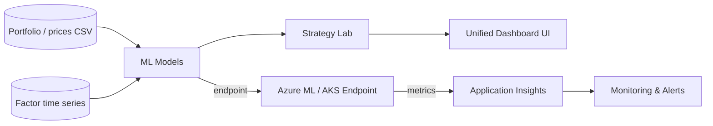

# Architecture Diagram (Placeholder)

Below is a lightweight ASCII/mermaid-friendly description of the planned
architecture. Replace with a formal diagram when ready.

Mermaid (conceptual):

Data flow:
- Offline: portfolio/factor CSVs -> ML model training -> saved artifact
- Online: ML endpoint receives features -> returns predictions -> Strategy Lab uses predictions to create recommended weights
